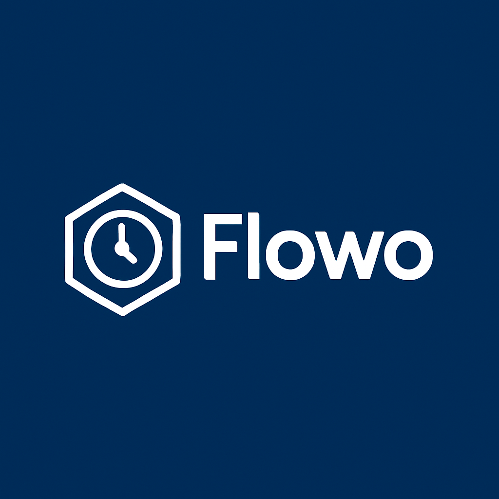
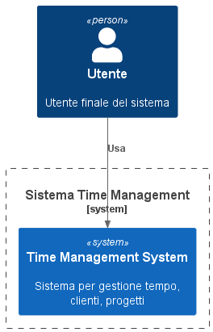
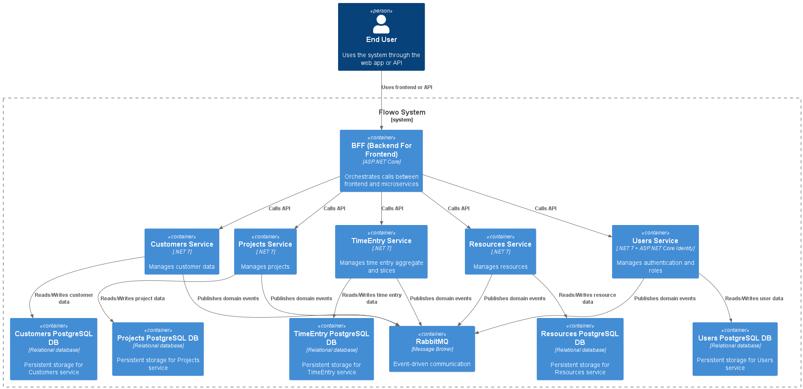
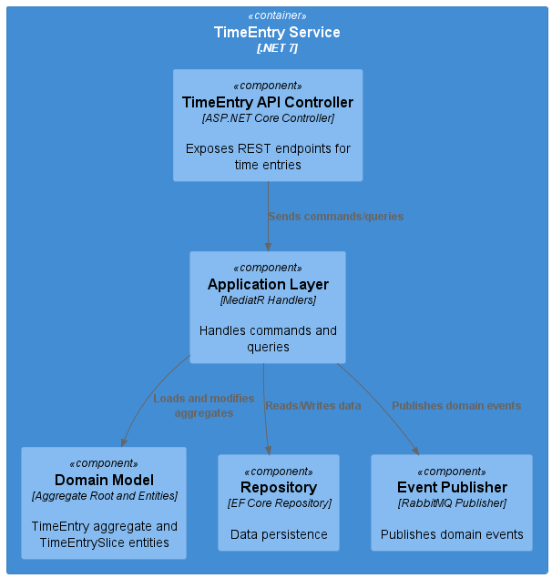
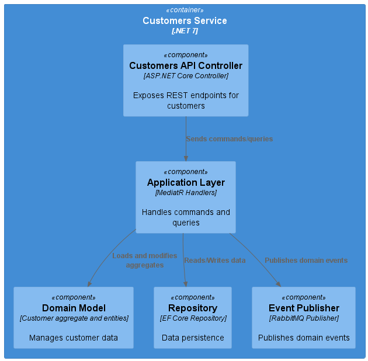
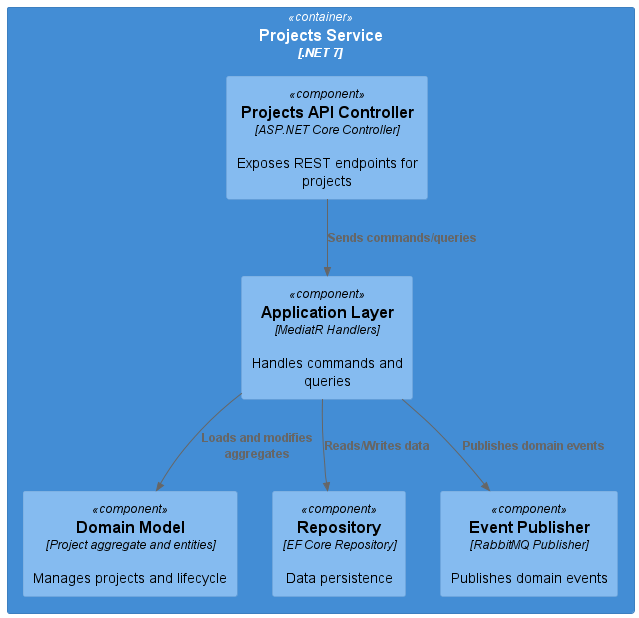
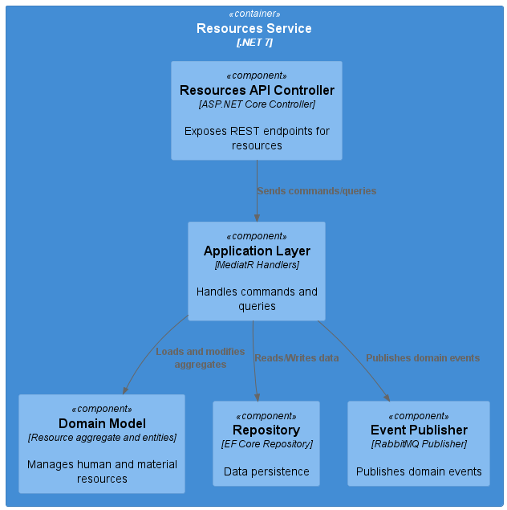
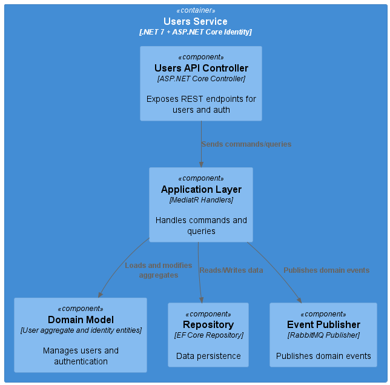

# Flowo

---

**Flowo** is a modular and scalable system designed for effective time tracking, project management, customer management, and resource allocation. Built on top of Domain-Driven Design (DDD), Clean Architecture, and Command-Query Separation (CQS), Flowo aims to provide a maintainable and extensible platform optimized for modern cloud-native environments.

  

---

## Table of Contents

- [Project Overview](#project-overview)
- [Domain Analysis and DDD](#domain-analysis-and-ddd)
  - [Bounded Contexts](#bounded-contexts)
  - [Entities and Aggregates](#entities-and-aggregates)
  - [Use Cases](#use-cases)
  - [Domain Events](#domain-events)
  - [Event Storming](#event-storming)
- [C4 Architecture Diagrams](#c4-architecture-diagrams)
  - [Level 1: System Context](#level-1-system-context)
  - [Level 2: Container](#level-2-container)
  - [Level 3: Components (All BCs)](#level-3-components-all-bcs)
- [Contributing](#contributing)
- [Project Best Practices](#project-best-practices)
- [Branching Strategy](#branching-strategy)
- [License](#license)

---

## Project Overview

**Flowo** is a modular and scalable system designed for effective time tracking, project management, customer management, and resource allocation. Built on top of Domain-Driven Design (DDD), Clean Architecture, and Command-Query Separation (CQS), Flowo aims to provide a maintainable and extensible platform optimized for modern cloud-native environments.

The system is divided into distinct Bounded Contexts (BC), each responsible for a specific domain area:

- **TimeEntry**: Manages time registrations and detailed time slices
- **Customers**: Handles customer data and contracts
- **Projects**: Manages projects and their lifecycle
- **Resources**: Manages human and material resources
- **Users**: Handles authentication, authorization, and user management

---

## Domain Analysis and DDD

### Bounded Contexts

| Bounded Context | Description                                      |
|-----------------|------------------------------------------------|
| **TimeEntry**   | Handles creation, modification, and approval of time entries and slices |
| **Customers**   | Manages customer records and contracts          |
| **Projects**    | Manages projects linked to customers             |
| **Resources**   | Manages resources including personnel and tools |
| **Users**       | Manages users, roles, authentication, and authorization |

---

### Entities and Aggregates

#### TimeEntry BC

The **TimeEntry** Bounded Context features a rich aggregate with child entities:

- **Aggregate Root: TimeEntry**

  - `Id` (GUID)  
  - `UserId` (GUID) — references the user who logged the time  
  - `ProjectId` (GUID) — references the project linked to the time entry  
  - `StartDate` (DateTime) — start timestamp of the first slice  
  - `EndDate` (DateTime) — end timestamp of the last slice  
  - `Status` (enum) — { Pending, Approved, Rejected }  
  - `Description` (string) — optional notes  
  - `Slices` (List<TimeEntrySlice>) — collection of time slices  

- **Child Entity: TimeEntrySlice**

  - `Id` (GUID)  
  - `StartTime` (DateTime)  
  - `EndTime` (DateTime)  
  - `Duration` (TimeSpan) — calculated from `EndTime - StartTime`  
  - `ActivityType` (enum) — e.g., Development, Meeting, Research  

---

### Use Cases

**TimeEntry BC:**

- Create a new `TimeEntry` with one or more `TimeEntrySlice`s  
- Modify or delete individual slices or entire time entries  
- Submit time entries for approval  
- Approve or reject time entries  
- Generate detailed time reports aggregated by project, user, and time period  

---

### Domain Events

| Event Name             | Description                                   |
|------------------------|-----------------------------------------------|
| `TimeEntryCreated`     | Triggered when a new time entry is created    |
| `TimeEntrySliceAdded`  | Triggered when a new time slice is added      |
| `TimeEntrySliceModified` | Triggered when a time slice is updated      |
| `TimeEntrySubmitted`   | Triggered when a time entry is submitted for approval |
| `TimeEntryApproved`    | Triggered when a time entry is approved       |
| `TimeEntryRejected`    | Triggered when a time entry is rejected       |

---

### Event Storming

Event storming sessions have been conducted to map out critical workflows such as:

- The time entry registration flow, from slice addition through approval or rejection  
- Customer and contract lifecycle management  
- Resource assignment and availability updates  

Full event storming diagrams and notes are available in the `/docs/event-storming` folder.

---

## C4 Architecture Diagrams

### Level 1: System Context

At the highest level, Flowo consists of multiple bounded contexts that communicate via REST APIs and event-driven messaging. End users access the system through web or API clients.

---

### Level 2: Container

Each bounded context is implemented as a separate microservice with its own PostgreSQL database, orchestrated by Kubernetes and connected to RabbitMQ for events. The Backend For Frontend (BFF) service orchestrates API calls.

---

### Level 3: Components (All BCs)

Component diagrams illustrating the internal structure of each microservice, including:

- API Controllers exposing REST endpoints  
- Application Layer with MediatR handling commands and queries  
- Domain Model containing aggregates and entities  
- Repository abstractions for EF Core persistence  
- Event Publisher components for RabbitMQ event emission  

#### TimeEntry
  

#### Customers

#### Projects
  

#### Resources
  

#### Users
  

---

## Contributing

Contributions are very welcome!

1. Fork the repository  
2. Create a feature or fix branch: `feature/your-feature` or `fix/your-fix`  
3. Write your code, tests, and documentation  
4. Open a Pull Request with a clear description  
5. Your PR will be reviewed and merged after approval  

Please follow the project best practices and branching strategy outlined below.

---

## Project Best Practices

- Strict adherence to Clean Architecture and Domain-Driven Design principles  
- Use of MediatR for CQRS patterns (commands and queries)  
- Validation with FluentValidation  
- High code coverage with automated unit and integration tests (>90%)  
- Domain events for decoupled inter-service communication  
- Automated CI/CD pipelines including linting, building, testing, and deploying  
- Comprehensive documentation and code comments  
- Resilience patterns (retry, circuit breaker) implemented where applicable  
- Semantic versioning and clear changelog management  

---

## Branching Strategy

We follow a **trunk-based development** branching model:

| Branch      | Purpose                                   |
|-------------|-------------------------------------------|
| `main`      | The single trunk branch, always deployable|
| `feature/*` | Short-lived branches for new features or fixes, merged quickly to `main` via PR |

- All development happens on short-lived feature branches created from `main`.
- Feature branches should be kept small and merged back to `main` as soon as possible after passing CI and code review.
- Releases and hotfixes are tagged directly on `main`.
- Avoid long-running branches; rebase frequently to keep up to date with `main`.
- Continuous integration ensures `main` is always in a deployable state.

---

## License

This project is licensed under the [MIT License](./LICENSE). See the LICENSE file for details.
